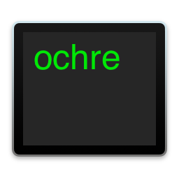

[]()
[](https://opensource.org/licenses/BSD-3-Clause)
[]()
[]()
[]()

# ochre



### macOS optical character recognition via the command line

`ochre` is a command line interface for the built-in **o**ptical **ch**aracter **re**cognition
(OCR) capabilities in macOS. As of macOS 10.15, Apple's operating system ships with excellent
OCR for a variety of written languages. This is an attempt to expose this functionality via
the command line since no such tool is provided Apple.

See the [man page](https://sveinbjorn.org/files/manpages/ochre.1.html) for further details.

## Download

`ochre` is free, open source software written in Objective-C using the Cocoa APIs.
The code is freely [available on GitHub](https://github.com/sveinbjornt/ochre).

* **[⬇ Download ochre 0.1.0](https://sveinbjorn.org/files/software/ochre.zip)** 
(~50 KB, Intel/ARM 64-bit, macOS 11 Big Sur or later, Developer ID signed and notarized by Apple)

## Installation

After downloading and expanding the archive, change to the resulting directory and run
the following command:

```bash
bash install.sh
```

This will install the binary into `/usr/local/bin` and the man page into
`/usr/local/share/man/man1/`.

### Install view Homebrew

A full installation of [Xcode](https://developer.apple.com/xcode/resources/) is required to build `ochre` via Homebrew.

```bash
brew tap sveinbjornt/ochre https://github.com/sveinbjornt/ochre
brew install sveinbjornt/ochre/ochre
```

## Usage

Defaults to looking for English text:

```bash
ochre path/to/image_with_english_text.png
```

To specify an alternative language (locale), e.g. French:

```bash
ochre -l fr-FR path/to/image_with_french_text.jpg
```

## Build

To build `ochre` from source, run the following command from the repository root
(requires Xcode command line build tools):

```bash
make build_unsigned
```

The resulting binary is created in `products/`.

## Testing

To run tests on the built command line tool, execute the following command from the repository root:

```bash
bash test/test.sh
```

## BSD License 

Copyright (c) 2022-2025 [Sveinbjorn Thordarson](mailto:sveinbjorn@sveinbjorn.org)  
Copyright (c) 2020 David Phillip Oster

Redistribution and use in source and binary forms, with or without modification,
are permitted provided that the following conditions are met:

1. Redistributions of source code must retain the above copyright notice, this
list of conditions and the following disclaimer.

2. Redistributions in binary form must reproduce the above copyright notice, this
list of conditions and the following disclaimer in the documentation and/or other
materials provided with the distribution.

3. Neither the name of the copyright holder nor the names of its contributors may
be used to endorse or promote products derived from this software without specific
prior written permission.

THIS SOFTWARE IS PROVIDED BY THE COPYRIGHT HOLDERS AND CONTRIBUTORS "AS IS" AND
ANY EXPRESS OR IMPLIED WARRANTIES, INCLUDING, BUT NOT LIMITED TO, THE IMPLIED
WARRANTIES OF MERCHANTABILITY AND FITNESS FOR A PARTICULAR PURPOSE ARE DISCLAIMED.
IN NO EVENT SHALL THE COPYRIGHT HOLDER OR CONTRIBUTORS BE LIABLE FOR ANY DIRECT,
INDIRECT, INCIDENTAL, SPECIAL, EXEMPLARY, OR CONSEQUENTIAL DAMAGES (INCLUDING, BUT
NOT LIMITED TO, PROCUREMENT OF SUBSTITUTE GOODS OR SERVICES; LOSS OF USE, DATA, OR
PROFITS; OR BUSINESS INTERRUPTION) HOWEVER CAUSED AND ON ANY THEORY OF LIABILITY,
WHETHER IN CONTRACT, STRICT LIABILITY, OR TORT (INCLUDING NEGLIGENCE OR OTHERWISE)
ARISING IN ANY WAY OUT OF THE USE OF THIS SOFTWARE, EVEN IF ADVISED OF THE
POSSIBILITY OF SUCH DAMAGE.

